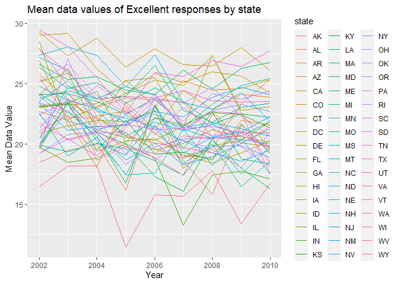
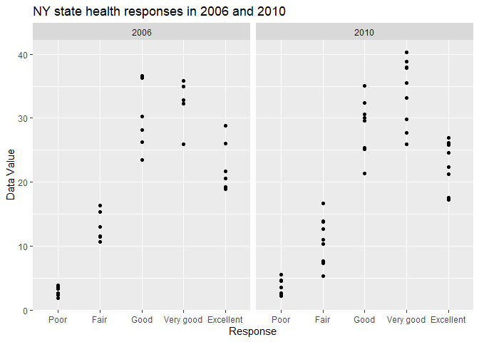
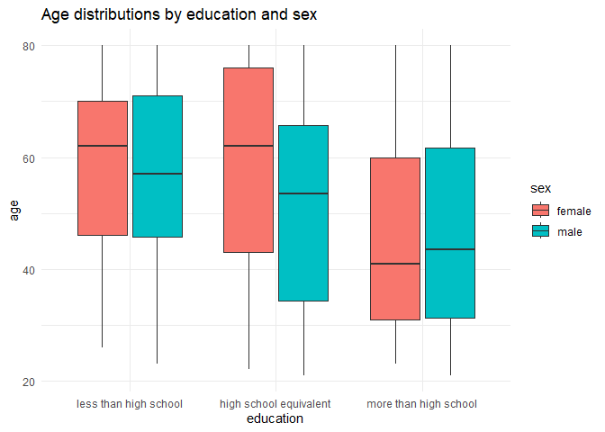
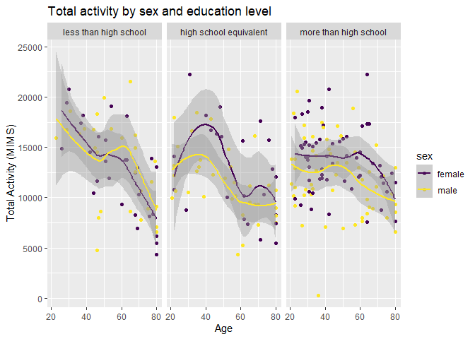
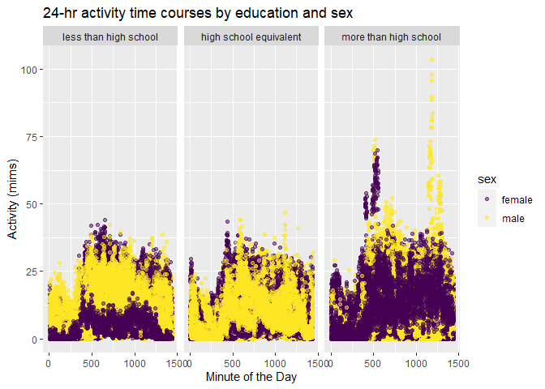

p8105_hw3_ss6692
================
2023-10-11

``` r
library(tidyverse)
library(readxl)
library(dplyr)
library(janitor)
library(tidyr)
library(knitr)
library(viridis)
```

## Problem 2

### Loading the dataset

``` r
library(p8105.datasets)
data("brfss_smart2010")
```

### Here, we are cleaning the data and filtering for “Overall Health.” We will then order the responses from Poor to Excellent.

``` r
brfss_df = brfss_smart2010 |>
  janitor::clean_names()|>
  select(-locationabbr)|>
  separate(locationdesc, into = c("state", "county"), sep = " - ")|>
    filter(topic == "Overall Health" & response %in% c("Excellent", "Very good", "Good", "Fair", "Poor")) |>
    mutate(response = factor(response, levels = c("Poor", "Fair", "Good", "Very good", "Excellent"), ordered = TRUE))
```

### Now, we will find which states which states were observed at 7 or more locations in 2002.

``` r
brfss_2002_df = 
   brfss_df|>
    filter(year == 2002) |>
    group_by(state) |>
    summarize(count = n()) |>
    filter(count >= 7)
kable(brfss_2002_df)
```

| state | count |
|:------|------:|
| AZ    |    10 |
| CO    |    20 |
| CT    |    35 |
| DE    |    15 |
| FL    |    35 |
| GA    |    15 |
| HI    |    20 |
| ID    |    10 |
| IL    |    15 |
| IN    |    10 |
| KS    |    15 |
| LA    |    15 |
| MA    |    40 |
| MD    |    30 |
| ME    |    10 |
| MI    |    20 |
| MN    |    20 |
| MO    |    10 |
| NC    |    35 |
| NE    |    15 |
| NH    |    25 |
| NJ    |    40 |
| NV    |    10 |
| NY    |    25 |
| OH    |    20 |
| OK    |    15 |
| OR    |    15 |
| PA    |    50 |
| RI    |    20 |
| SC    |    15 |
| SD    |    10 |
| TN    |    10 |
| TX    |    10 |
| UT    |    25 |
| VT    |    15 |
| WA    |    20 |

In 2002, 36 states were observed at 7 or more locations.

### Now we are finding the same information for 2010.

``` r
brfss_2010_df = 
   brfss_df|>
    filter(year == 2010) |>
    group_by(state) |>
    summarize(count = n()) |>
    filter(count >= 7)
kable(brfss_2010_df)
```

| state | count |
|:------|------:|
| AL    |    15 |
| AR    |    15 |
| AZ    |    15 |
| CA    |    60 |
| CO    |    35 |
| CT    |    25 |
| DE    |    15 |
| FL    |   205 |
| GA    |    20 |
| HI    |    20 |
| IA    |    10 |
| ID    |    30 |
| IL    |    10 |
| IN    |    15 |
| KS    |    20 |
| LA    |    25 |
| MA    |    45 |
| MD    |    60 |
| ME    |    30 |
| MI    |    20 |
| MN    |    25 |
| MO    |    15 |
| MS    |    10 |
| MT    |    15 |
| NC    |    60 |
| ND    |    15 |
| NE    |    50 |
| NH    |    25 |
| NJ    |    95 |
| NM    |    30 |
| NV    |    10 |
| NY    |    45 |
| OH    |    40 |
| OK    |    15 |
| OR    |    20 |
| PA    |    35 |
| RI    |    25 |
| SC    |    35 |
| SD    |    10 |
| TN    |    25 |
| TX    |    80 |
| UT    |    30 |
| VT    |    30 |
| WA    |    50 |
| WY    |    10 |

In 2010, 45 states were observed at 7 or more locations.

### Now, we are creating a dataset containing only “Excellent” responses. We will also add a new variable that averages `data_value` across locations, but within states.

``` r
excellent_df =
  brfss_df |>
  filter(response == "Excellent")|>
group_by(state, year) |>
  summarize(avg_data_value = mean(data_value, na.rm = TRUE))
```

    ## `summarise()` has grouped output by 'state'. You can override using the
    ## `.groups` argument.

### We will use the excellent_df to create a spaghetti plot

``` r
excellent_df |> 
  ggplot(aes(x = year, y = avg_data_value, color = state)) + 
  geom_line() +
  labs(title = "Mean data values of Excellent responses by state ", 
        x = "Year",
        y = "Mean Data Value")
```

<!-- -->

The spaghetti plot shows the mean data values of excellent responses by
state. In general, most states observe mean data values of excellend
reposnses around 20-25.

``` r
nyc_df =
  brfss_df |>
  filter((year == 2006 | year == 2010) & state == "NY") |>
  select(year, response, data_value, county)
  
nyc_df |>
  ggplot(aes(x=response, y=data_value)) +
  geom_point() +
  facet_grid(. ~ year) + 
  labs(title = "NY state health responses in 2006 and 2010", 
        x = "Response",
        y = "Data Value") 
```

<!-- -->

As shown by the plots, 2010 had better health responses, with a peak at
very good responses. In 2006, the data value peaks at good-very good
responses.

## Problem 3

``` r
nhanes_accel_df = read_csv(file = "data/nhanes_accel.csv")|>
  janitor::clean_names()|>
 pivot_longer(
    min1:min1440,
    names_to = "minute",
    names_prefix = "min",
    values_to = "mims"
  )
```

    ## Rows: 250 Columns: 1441
    ## ── Column specification ────────────────────────────────────────────────────────
    ## Delimiter: ","
    ## dbl (1441): SEQN, min1, min2, min3, min4, min5, min6, min7, min8, min9, min1...
    ## 
    ## ℹ Use `spec()` to retrieve the full column specification for this data.
    ## ℹ Specify the column types or set `show_col_types = FALSE` to quiet this message.

``` r
nhanes_covar_df = read_csv(file = "data/nhanes_covar.csv",skip = 4, na = "." )|>
  janitor::clean_names() |>
 mutate(
    sex = ifelse(sex == 1, "male", "female"), 
    education = case_match(education,
                           "1" ~ "less than high school", 
                           "2" ~ "high school equivalent", 
                           "3" ~ "more than high school"), 
    education = fct_relevel(education, c("less than high school", "high school equivalent", "more than high school"))
    )|> 
      filter(age >= 21) |> 
      drop_na()
```

    ## Rows: 250 Columns: 5
    ## ── Column specification ────────────────────────────────────────────────────────
    ## Delimiter: ","
    ## chr (2): BMI, education
    ## dbl (3): SEQN, sex, age
    ## 
    ## ℹ Use `spec()` to retrieve the full column specification for this data.
    ## ℹ Specify the column types or set `show_col_types = FALSE` to quiet this message.

``` r
MIMS_df = 
  inner_join(nhanes_covar_df, nhanes_accel_df)
```

    ## Joining with `by = join_by(seqn)`

### Now we are creating a table to show the number of males and females in each education group.

``` r
education_df = MIMS_df |>
  group_by(education, sex) |>
  summarize(count = n()) |>
  pivot_wider(names_from = sex, values_from = count) 
```

    ## `summarise()` has grouped output by 'education'. You can override using the
    ## `.groups` argument.

``` r
kable(education_df)
```

| education              | female |  male |
|:-----------------------|-------:|------:|
| less than high school  |  41760 | 40320 |
| high school equivalent |  33120 | 51840 |
| more than high school  |  84960 | 80640 |

The table shows that more than a high school education is the largest
education group, and females with a high school equivalent education is
the smalles group.

### Now, we will create a visualization of the age distributions for men and women in each education category.

``` r
ggplot(MIMS_df, aes(x = education, y = age, fill = sex)) +
  geom_boxplot() +
  labs(title = "Age distributions by education and sex",
       x = "education",
       y = "age") +
  theme_minimal()
```

<!-- -->

As shown by the box plot, males and females with more than a high school
education have the lowest median age, and females with less than a high
school education and high school equivalent education have the highest
median age. The age distribution of both males and females with more
than a high school education is right skewed, and the distribution of
both males and females of a high school equivalent education, and
females with less than a high school education is slightly left skewed.
The age distribution of males with less than a high school education is
fairly normally distributed.

### Now, we will make a plot to show the distributin of total activity by sex and education level.

``` r
MIMS_df |> 
  group_by(seqn, age, sex, education) |> 
  summarize(total_activity = sum(mims)) |> 
  ggplot(aes(x = age, y = total_activity, color = sex)) + 
  geom_point() +
  geom_smooth() +
  facet_grid(. ~ education) + 
  labs(title = "Total activity by sex and education level", 
        x = "Age",
        y = "Total Activity (MIMS)") +
    scale_color_viridis_d() 
```

    ## `summarise()` has grouped output by 'seqn', 'age', 'sex'. You can override
    ## using the `.groups` argument.
    ## `geom_smooth()` using method = 'loess' and formula = 'y ~ x'

<!-- -->

As shown by all three panels of the plot, total activity tends to
decrease as age increases, regardless of education level. Both men and
women with less than a high school education have the highest total
activity level across groups around age 20.

### Finally, we are making a plot to visualize 24-hr activity time courses by education and sex.

``` r
MIMS_df |>
  mutate(
    minute = as.numeric(minute)
  ) |> 
ggplot(aes(x = minute, y = mims, color = sex)) +
   geom_point(alpha = 0.5) +
  facet_grid(. ~ education) + 
  labs(title = "24-hr activity time courses by education and sex", 
        x = "Minute of the Day",
        y = "Activity (mims)") +
      scale_color_viridis_d() 
```

<!-- -->

Across all three education levels and both sexes, activity level reaches
a peak around the 500th minute of the day. Both men and women with more
than a high school education have the highest peak at 500 minutes of
about 75 MIMS. We observe another peak among men with more than a high
school education around minute 1250, with the highest point reaching
over 100 MIMS.
